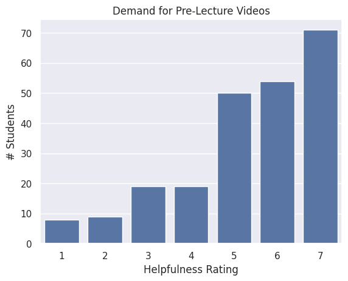
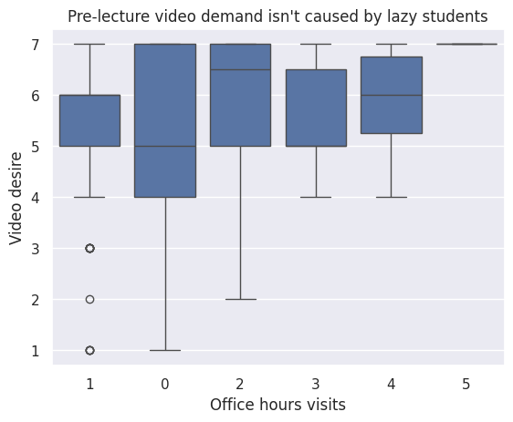
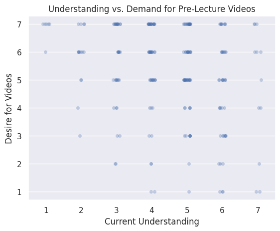

---
# Do not edit the text between these lines!
layout: default
---

# COMP110 Data Analysis on Pre-Lecture Videos
By: Adrian Groman

## The Baseline Demand
First, I wanted to establish if there is authentic demand for this idea. 

As you can see, there is almost unanimous support for PLVs.
## Relationship Between understanding and desire for Pre-Lecture videos
There is a slight inverse relationship between understanding and desire for the PLVs. This shows that people who struggle tend to want these videos more, and to imrpove the course we should target those who are falling behind.

## Do people just want Pre-Lecture videos so they can skip class?

    

## Conclusion
    The data lightly supports my idea that we should introduce pre-lecture videos into the course because a majority of students support it, but the data regarding whether it would help is not significant enough to draw any conclusion. For the data to be statistically significant, we would need more data on students grades and their desire for pre-lecture videos. This would give us another metric to compare it to and hopefully help us draw a conclusion on. One cost this idea would incur would be hours of time taken by the professor setting up these lectures. While there is little data to support this idea, there is no data suggesting it would be detrimental to student performance